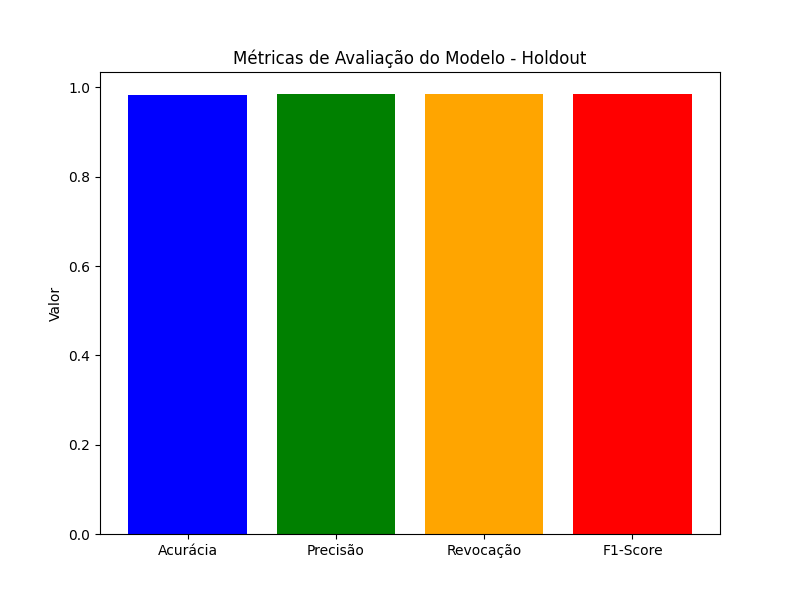
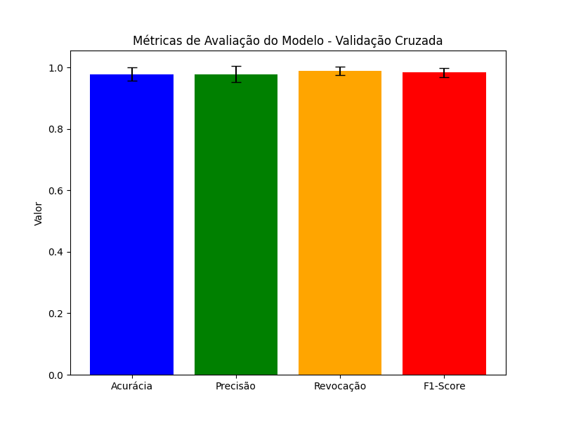

# Lista 3: Regressão Logística

# **Instituto Federal do Ceará**  
## **Campus Maracanaú**  

**Professor**: Hericson Araújo  
**Disciplina**: Reconhecimento de Padrões  
**Aluno**: Francisco Aldenor Silva Neto  
**Matrícula**: 20221045050117  

---

## 1. Introdução  

Este relatório descreve a implementação e avaliação de um modelo de Regressão Logística aplicado ao conjunto de dados "breastcancer.csv". O objetivo principal da atividade foi implementar o modelo de Regressão Logística do zero, calcular suas métricas de desempenho utilizando holdout e validação cruzada, e discutir os resultados.

---

## 2. Objetivo  

O objetivo deste exercício é implementar a Regressão Logística, utilizando gradiente descendente, e avaliar o desempenho do modelo em termos de acurácia, precisão, revocação, F1-score e matriz de confusão. A avaliação será realizada tanto usando o método de holdout quanto a validação cruzada (10 folds).  

---

## 3. Metodologia  

### 3.1 Base Teórica  

#### **Função Sigmoide**  

A Regressão Logística utiliza a função sigmoide para transformar uma combinação linear das entradas em uma probabilidade. A função sigmoide é dada por:  

\[ 
\sigma(z) = \frac{1}{1 + e^{-z}}
\]  

onde \(z = X \cdot \theta\), sendo:  
- \(X\): matriz de características  
- \(\theta\): vetor de pesos do modelo  

#### **Função de Custo (Entropia Cruzada)**  

A função de custo utilizada para a Regressão Logística é a entropia cruzada, definida como:  

\[
J(\theta) = -\frac{1}{m} \sum_{i=1}^{m} \left[ y^{(i)} \log(h_\theta(x^{(i)})) + (1 - y^{(i)}) \log(1 - h_\theta(x^{(i)})) \right]
\]  

onde:  
- \(m\): número de amostras  
- \(h_\theta(x^{(i)}) = \sigma(z^{(i)})\): predição para a amostra \(i\)  
- \(y^{(i)}\): rótulo verdadeiro da amostra \(i\)  

#### **Gradiente Descendente**  

Para minimizar a função de custo, utiliza-se o gradiente descendente. A atualização dos pesos \(\theta\) é feita pela fórmula:  

\[
\theta_j := \theta_j - \alpha \cdot \frac{\partial J(\theta)}{\partial \theta_j}
\]  

onde:  
- \(\alpha\): taxa de aprendizado  
- \(\frac{\partial J(\theta)}{\partial \theta_j}\): gradiente da função de custo em relação ao peso \(\theta_j\).  

O gradiente para cada peso \(\theta_j\) é dado por:  

\[
\frac{\partial J(\theta)}{\partial \theta_j} = \frac{1}{m} \sum_{i=1}^{m} \left[ h_\theta(x^{(i)}) - y^{(i)} \right] \cdot x_j^{(i)}
\]  

---

### 3.2 Preparação dos Dados  

O conjunto de dados "breastcancer.csv" foi carregado, e as variáveis independentes (features) e a variável dependente (rótulo) foram extraídas. Para garantir que todas as features estivessem na mesma escala, foi aplicada a normalização Min-Max, onde os valores foram escalonados para o intervalo [0, 1].  

---

### 3.3 Implementação do Modelo  

O modelo de Regressão Logística foi implementado utilizando as equações descritas na seção teórica. A implementação envolveu:  
- Cálculo da função sigmoide para predição das probabilidades.  
- Implementação da função de custo baseada na entropia cruzada.  
- Atualização dos pesos \(\theta\) utilizando gradiente descendente.  

---

### 3.4 Divisão de Dados (Holdout)  

O conjunto de dados foi dividido em 80% para treino e 20% para teste, conforme especificado na atividade. As métricas de avaliação (acurácia, precisão, revocação, F1-score) foram calculadas para o conjunto de teste.  

---

### 3.5 Validação Cruzada (10 Folds)  

A validação cruzada foi realizada utilizando 10 folds. Em cada iteração, 90% dos dados foram usados para treino, e 10% para teste. As métricas de desempenho foram calculadas para cada fold, e as médias e desvios padrão foram reportados.  

---

## 4. Resultados  

### 4.1 Resultados do Holdout  

- **Acurácia**: 0.9825  
- **Precisão**: 0.9853  
- **Revocação**: 0.9853  
- **F1-Score**: 0.9853  

#### Matriz de Confusão:  
- **TP** (True Positives): 67  
- **FP** (False Positives): 1  
- **FN** (False Negatives): 1  
- **TN** (True Negatives): 45  

  

---

### 4.2 Resultados da Validação Cruzada (10 Folds)  

- **Acurácia**: Média = 0.9786, Desvio Padrão = 0.0208  
- **Precisão**: Média = 0.9785, Desvio Padrão = 0.0264  
- **Revocação**: Média = 0.9886, Desvio Padrão = 0.0140  
- **F1-Score**: Média = 0.9833, Desvio Padrão = 0.0158  

  

---

## 5. Discussão  

Os resultados obtidos indicam que o modelo de Regressão Logística implementado está funcionando muito bem, com uma alta acurácia de 98.25% no conjunto de teste. As métricas de precisão, revocação e F1-score também são muito boas, todas acima de 98%. A matriz de confusão mostra que o modelo cometeu apenas 1 erro de falso positivo e 1 de falso negativo, o que é um bom indicativo de que o modelo está prevendo corretamente a maioria dos casos.  

A validação cruzada forneceu resultados consistentes, com médias de desempenho próximas às do holdout, o que sugere que o modelo está generalizando bem para dados não vistos.  

---

## 6. Conclusão  

O modelo de Regressão Logística implementado obteve um desempenho excelente, tanto na avaliação com holdout quanto na validação cruzada. As métricas de avaliação indicam que o modelo é altamente eficaz na tarefa de classificação do câncer de mama. O modelo não apresentou sinais de overfitting, já que as métricas de desempenho se mantiveram consistentes entre o holdout e a validação cruzada.  

## 7.Repositório
[Repositório no GitHub - Regressão Logística](https://github.com/Aldenor-Neto/Regressao-Logistica)
